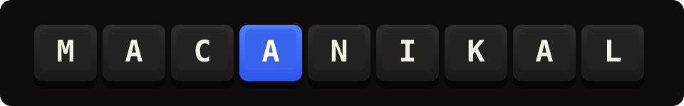

<p align="center">
  
</p>

<h3 align="center">Real mechanical keyboard sounds for every keystroke on your Mac.</h3>

<p align="center">
  <a href="https://techieasif.github.io/macanikal/"><b>🔊 Try the switches in your browser →</b></a>
</p>

<p align="center">
  
  
  
  
</p>

---

**Macanikal** is a tiny menu bar app that plays genuine mechanical keyboard switch recordings as you type — on any keyboard, in any app. Built for people who love the *thock* but work in an open office, on a laptop, or next to a sleeping cat.

## ✨ Features

- 🎧 **13 real switch packs** — recorded from actual boards, not synthesized
- ⚡ **Obsessively low latency** — sound starts on the next audio render cycle after your keystroke
- 🎹 **Row-accurate samples** — each keyboard row has its own recording; space, enter, and backspace sound like space, enter, and backspace
- 🔼🔽 **Press *and* release sounds** — just like the real thing
- 🎲 **Humanized playback** — subtle random pitch, stereo position, and level per keystroke so fast typing never sounds robotic
- 🍎 **Native SwiftUI menu bar app** — no dock icon, no electron, no nonsense
- 🔒 **Private by design** — a listen-only event tap plays sounds; keystrokes are never logged, stored, or sent anywhere

## 🎛 Switch library

| Switch | Type | Character |
|---|---|---|
| Cherry MX Brown | Tactile | The classic all-rounder bump |
| Cherry MX Blue | Clicky | Sharp, crisp, unapologetic |
| Cherry MX Black | Linear | Smooth and muted |
| Holy Panda | Tactile | The community-favorite deep thock |
| NovelKeys Cream | Linear | Poppy, clacky POM |
| Topre | Thocky | Electro-capacitive *thoomp* |
| Alpaca | Linear | Smooth with a bright tail |
| Gateron Black Ink | Linear | Deep and creamy |
| Gateron Red Ink | Linear | Lighter ink, same cream |
| Tealios | Linear | Glassy smooth |
| Kailh Box Navy | Clicky | Thick, heavy click |
| IBM Buckling Spring | Clicky | 1984 called, it sounds amazing |
| Blue Alps | Clicky | Vintage crispness |

Sound recordings come from the MIT-licensed [kbsim](https://github.com/tplai/kbsim) project by Thomas Lai. 🙏

## ⚡ How it stays fast

Latency is the whole point of this app. The keystroke-to-sound path is engineered to stay in single-digit milliseconds:

```
keystroke
   │  listen-only CGEventTap on a dedicated userInteractive thread
   ▼
key code → row/space/enter/backspace mapping (no allocation, no locks held)
   │
   ▼
pre-decoded PCM buffer  ──►  always-running AVAudioPlayerNode pool (×14)
                                │  scheduleBuffer(.interrupts) — plays on the
                                │  very next render cycle, no stop/start
                                ▼
                     hardware IO buffer forced to 128 frames (~2.7 ms @ 48 kHz)
```

Plus two details that matter more than they sound:

- **Leading-silence trimming.** Recorded samples typically hide 5–20 ms of dead air before the transient. Macanikal trims every sample to its attack at load time — that dead air is indistinguishable from input lag.
- **No decoding at keystroke time.** All 150 samples are decoded to raw PCM once at launch and kept in memory (~10 MB). A keystroke only picks a buffer and schedules it.

## 🚀 Getting started

Requires Xcode 15+ on macOS 14+. No Apple Developer account needed.

```bash
git clone https://github.com/techieasif/macanikal.git
cd macanikal && ./build.sh
```

The script builds, signs (ad-hoc), and launches the app. Then:

1. Grant **Input Monitoring** when macOS asks — it's how the app knows *when* you press a key. Listen-only; nothing is recorded.
2. Click the ⌨️ icon in the menu bar, pick a switch, type something glorious.

> Hacking on the code? Open `macanikal.xcodeproj` in Xcode, pick your team under Signing & Capabilities, and hit ⌘R.

## ❓ FAQ

**Can keyboard sounds keep playing while my Mac is muted?**
No — mute happens at the hardware output, so it silences every app. What you probably want instead: mute the noisy *site or app* (right-click a browser tab → mute) and leave system volume up. Macanikal's volume is independent.

**Does it work with any keyboard?**
Yes — laptop keyboards, external boards, anything that produces macOS key events.

**Why don't arrow keys / modifiers sound different?**
They do get row-appropriate samples; dedicated recordings only exist for space, enter, and backspace.

**Is my typing being logged?**
No. The event tap is listen-only, key codes are mapped to a sound and immediately discarded, and the app has no network access of any kind.

## 🛠 Project layout

```
macanikal/
├── MacanikalApp.swift        # MenuBarExtra entry point
├── AppController.swift       # settings, key→sample mapping, humanization
├── KeyEventTap.swift         # listen-only CGEventTap on a dedicated thread
├── SoundEngine.swift         # AVAudioEngine voice pool, trimming, normalization
├── ControlPanelView.swift    # the SwiftUI panel
└── Resources/Audio/<pack>/   # 13 switch packs (press/ + release/ mp3s)
```

## 📄 License

[MIT](LICENSE) — sounds © [kbsim](https://github.com/tplai/kbsim) (MIT).

*Not affiliated with Cherry, Gateron, Kailh, Topre, IBM, or any switch manufacturer — the names identify the recorded switches.*
